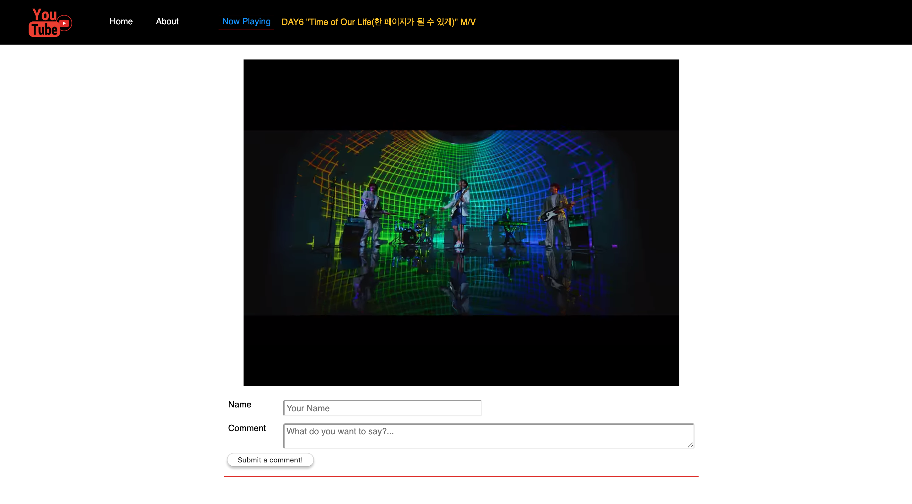

# YouTube Abbreviated (a React front-end app)

YouTube Abbreviated is a straightforward multiple component React app where a user can query and obtain YouTube video results, watch embedded videos, and comment on them locally.



## Developer: [**Joseph P. Pasaoa**](https://github.com/joseph-p-pasaoa)

## Technologies Used
+ React 16.12.0
+ React-Router 5.1.2
+ Node.js 12.14.1
+ JavaScript ES5+
+ YouTube Developer API v3
+ React-YouTube 7.9.0
+ Axios 0.19.1
+ HTML5
+ CSS3

## Setup

+ To run **YOUTUBE ABBREVIATED** locally, install the React app locally using npm:
  ```
  $ npm install
  $ npm start
  ```
+ The app will be found in your browser at [http://localhost:11070/](http://localhost:11070/)

+ #### IMPORTANT: Required YouTube API Key for local installation
  - To be able to make requests/calls to the YouTube API you will need to get an API key and use it in your network requests. Learn [How to get an API key here](./readme/how_to_get_youtube_api_key.md)
  - Once you receive the API Key put it inside of a file in `src/helpers/` that can be named `secrets.js` and export it like so:
    ```js
    // src/helpers/secrets.js
    const API_KEY = <YOUR_ACTUAL_API_KEY>
    export default API_KEY
    ```


## Features
- Responsive Navbar with links
- Homepage with search form and results area
- Video page to play a video and leave comments
- About page with short description

---
*This repo was created to continue work on **YouTube Abbreviated** from deployment onward. The original repo for this project can be found [here](https://github.com/joseph-p-pasaoa/Pursuit-Core-Web-Unit-4-Assessment).*
